# Overview
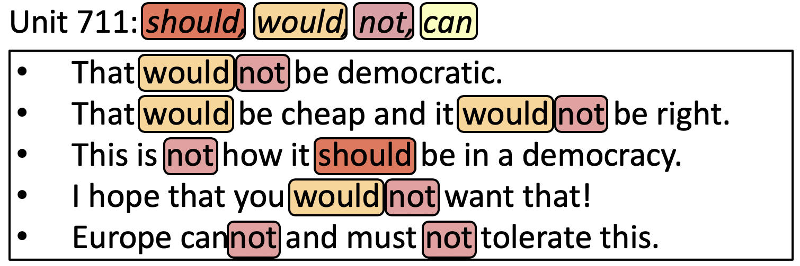

This repository contains an implementation of our ICLR 2019 paper;

* [Seil Na](seilna.github.io), [Yo Joong Choe](https://yjchoe.github.io/), [Dong-Hyun Lee](https://scholar.google.com/citations?user=Iw-G2qIAAAAJ&hl=en) and [Gunhee Kim](http://vision.snu.ac.kr/~gunhee/). [Discovery of Natural Language Concepts in Individual Units of CNNs](https://openreview.net/forum?id=S1EERs09YQ)

**TL;DR**: Individual units of deep CNNs learned in NLP tasks (e.g. translation, classification) could act as a natural language concept detector.

This work covers the interpretability of Deep Neural Network. We expect that it sheds useful light on how the representation of Deep CNNs learned in language tasks represents the given text.

We show that **several information in the given text are not distributed across all units of representation**. We observe AND quantify that **even a single unit** can act as a _natural language concept (e.g. morpheme, word, phrase)_ detector.

---
# Visualizing Individual Units

In this work, we align three _natural language concepts_ per unit. Most units are selectively responsive to the concepts we align. If you want to see the full results, see [Optional-Full Visualization Results](#optional-full-visualization-results).

## Natural Language Concepts

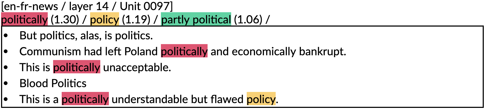
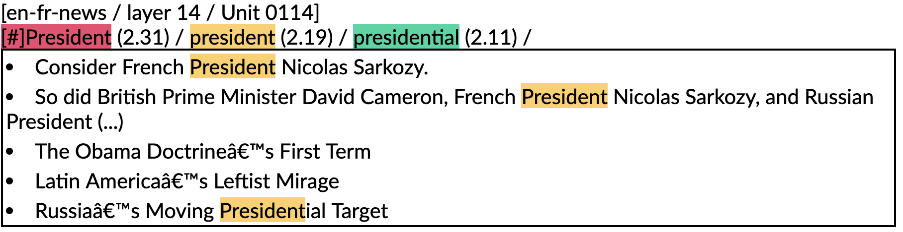
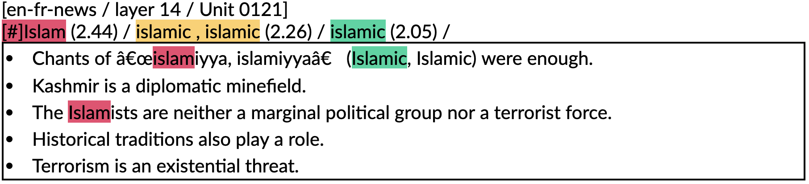
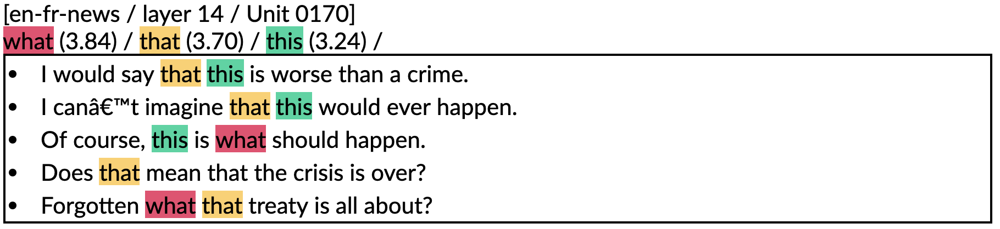
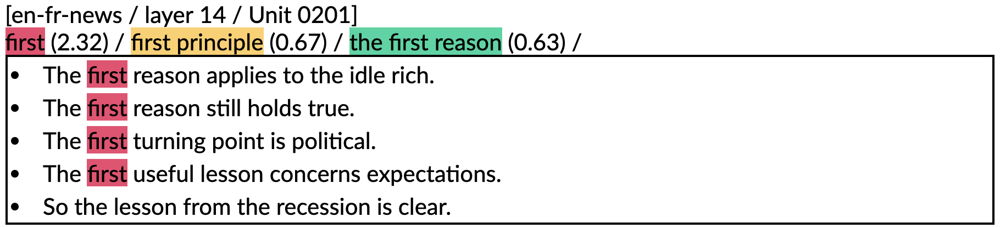

## Concepts that go beyond natural language form

We also discovered that several units tend to capture the concepts that go beyond natural langauge form. Although it is relatively hard to _quantify_ it, we belive that further investigation would be one of interesting future direction. We visualize some units that capture abstract form concepts as follows:

### Number
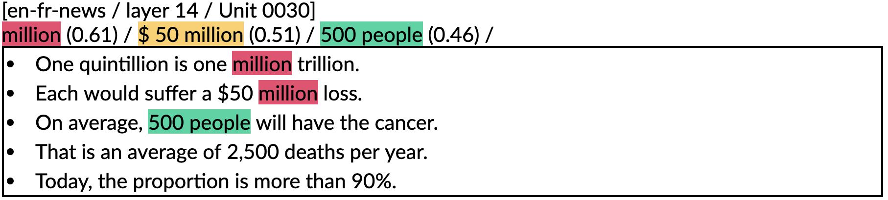
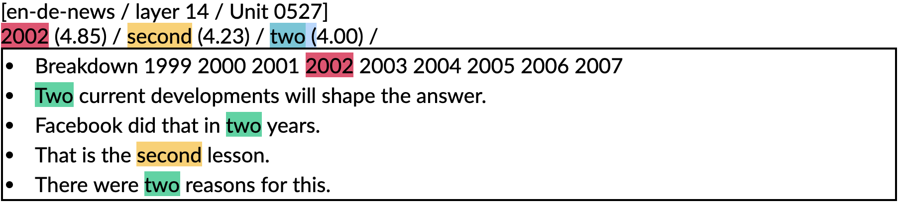

### Number + Time
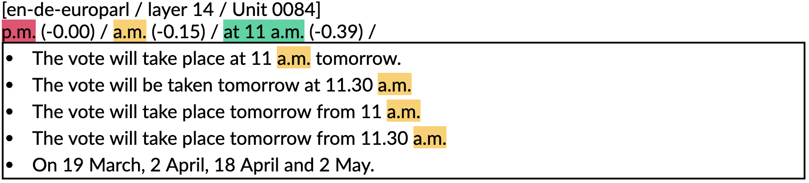
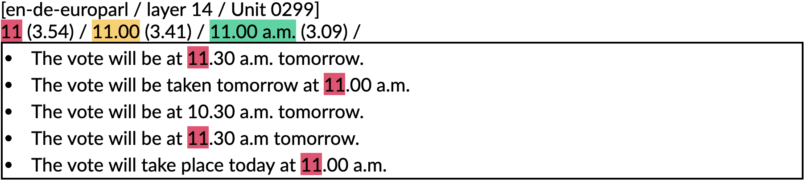

### Number + Question
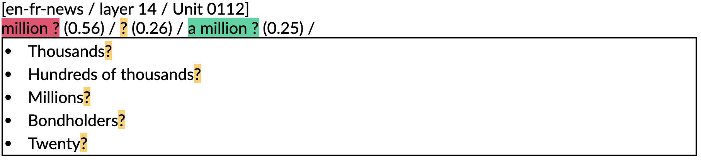

### Quantity
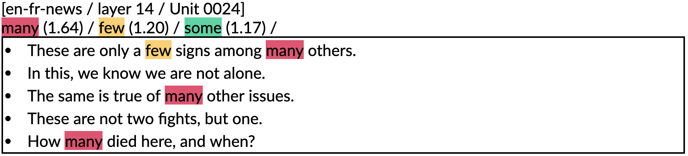

### Wh-questions
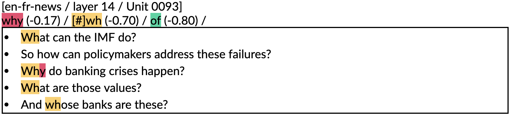
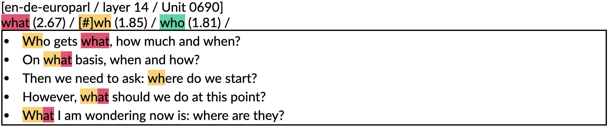

### A Demonstrative Pronoun
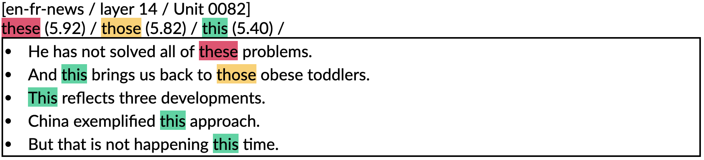

### Similar Meaning or Role
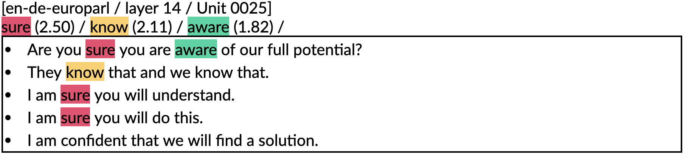
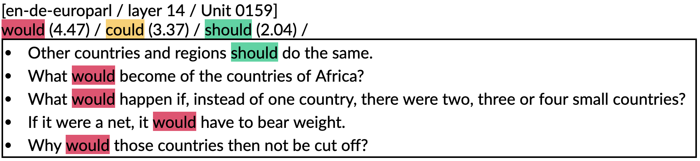
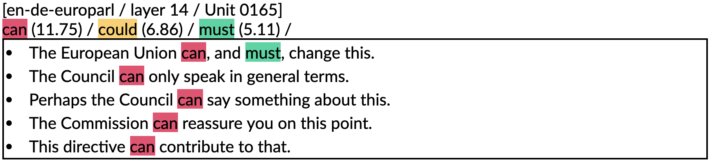
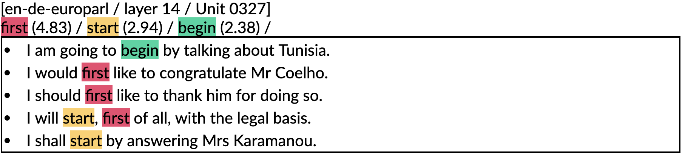
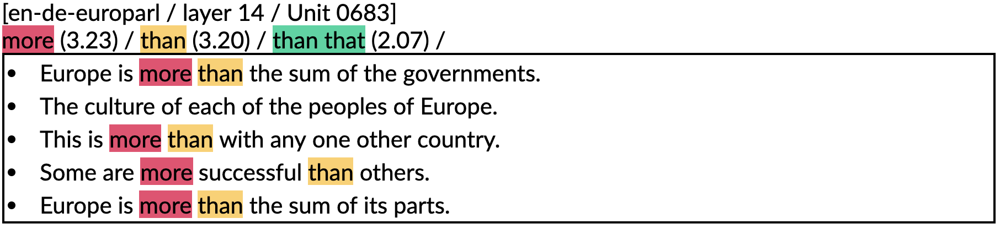

### Polarity (Positive)
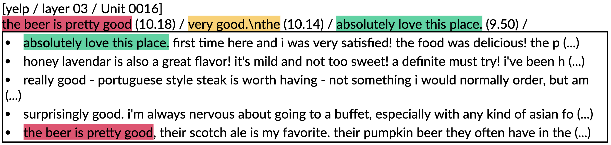
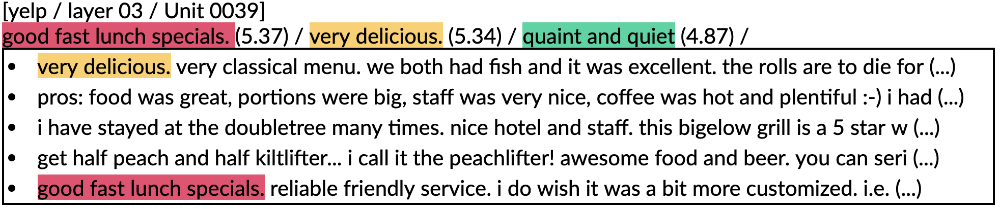

### Polarity (Negative)
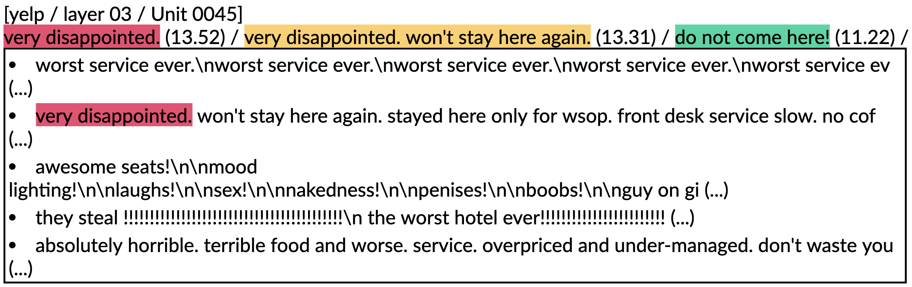
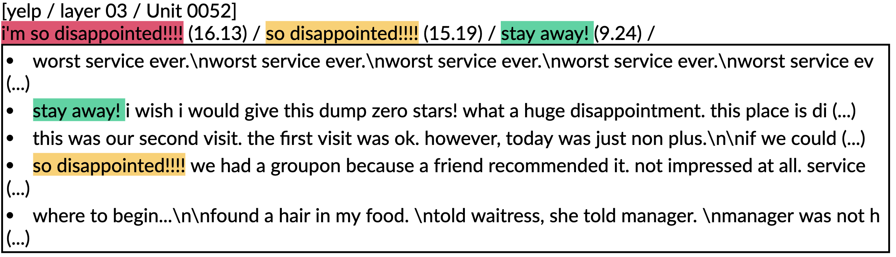

---

# Run
If you want to get the results without running the code, skip these parts and go to [Optional-Full Visualization Results](#optional-full-visualization-results).

## Prerequisites
* Python 2.7
* tensorflow-gpu==1.10.0

## Download
* Clone the code from GitHub.
```
git clone https://github.com/seilna/CNN-Units-in-NLP.git
```

* Create environment via [`conda`](https://www.anaconda.com/distribution/) & downlaod spacy (english) model
```
conda env create -f environment.yml
python -m spacy download en
```

* Download training data & pretrained models (**~160GB space**)
```
cd script
bash setup.sh 
```

## Running Visualization Code
```
cd script
bash run.sh 
```
will save visualization results at `visualization/`.

or skip to [Optional-Full Visualization Results](#optional-full-visualization-results).


## Optional-Full Visualization Results 
```
cd script
bash download_visualization.sh
```

or [link](https://drive.google.com/open?id=136RtLeKwQHvhxH04rLt_ZiVImeDUdvpV)

---
# Reference
If you find the code useful, please cite the following paper.

```
@inproceedings{
  Na:ICLR:2019,
  title = "{Discovery of Natural Language Concepts in Individual Units of CNNs}",
  author = {Seil Na and Yo Joong Choe and Dong-Hyun Lee and Gunhee Kim},
  booktitle = {International Conference on Learning Representations},
  year = {2019},
  url = {https://openreview.net/forum?id=S1EERs09YQ},
}
```

---
# Acknowledgements

We appreciate <a href="http://vision.snu.ac.kr/people/insujeon.html">Insu Jeon</a>, <a href="https://j-min.io/">Jaemin Cho</a>, <a href="https://shmsw25.github.io/">Sewon Min</a>, <a href="https://yunseokjang.github.io/">Yunseok Jang</a> and the anonymous reviewers for their helpful comments and discussions. This work was supported by <a href="https://www.kakaocorp.com/">Kakao</a> and <a href="http://kakaobrain.com/">Kakao Brain</a> corporations, IITP grant funded by the Korea government (MSIT) (No. 2017-0-01772) and Creative Pioneering Researchers Program through Seoul National University.

---
# Contact
Have any question? Please contact:

`seil.na@vision.snu.ac.kr`
